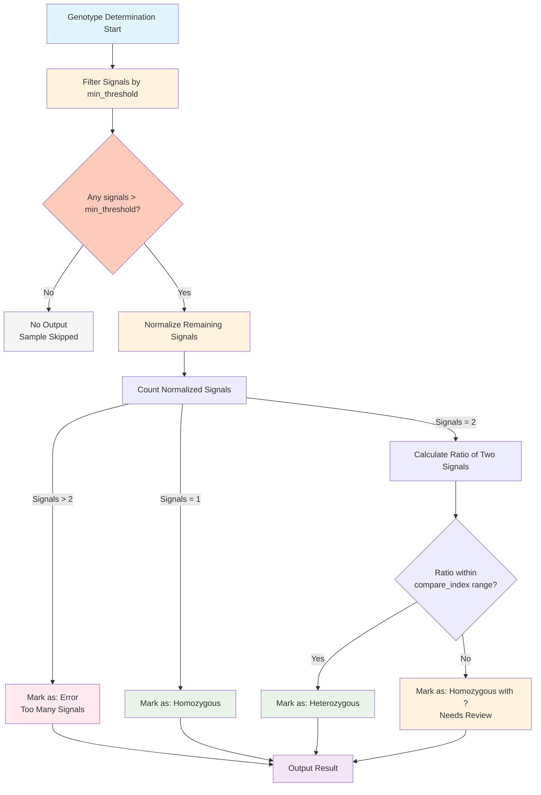

# Tiny tool for Hi-TOM genotyping data orgnization

### Introduction
Though Hi-TOM do offer analysis on genotype based on sequence information, it provide little information we need. This project is a tiny tool to extract genotype, specific mutation, and organise these data.

It determines the genotype with a `min_threshold` and a `compare_index`.
Signal <= `min_threshold` is abandent, and the sample without signal left won't be shown;
samples with more than 2 signals after filtering are marked as "error";
samples with only one signal are marked as correspondent type;
samples with 2 signals would compute the ratio of 2 figures, that within `compare_index` are marked as heterozygote, the rest marked as heterozygote with a "?".



### To start with
\n


After you upload your data to Hi-TOM website, you are likely to get results like this:\n


Each of them contain sequence and genotype information.\n


Put the `*Sequence.xls` file in a single folder. That's all preparation you need for these data.\n


# Pipeline

File structure:
```sh
C:.
│  .gitignore
│  filetree.txt
│  LICENSE
│  README.md # instruction
│  
└─genotyping_result_analysis
        .Rhistory
        genotyping_result_analysis.R # core function, single version
        genotyping_result_analysis.Rproj
        genptype_marking_func.R # core function, function version
        main.R # you only need to run this
        summarize_data_in_folder_func.R # read data

```

Clone the code from github.
```sh
git clone https://github.com/CharlesV555/Hi-TOM-table-orgnization.git
```
Enter the main.R by R.


>[!Note] R requirement
>R version 4.5.1 (2025-06-13 ucrt) -- "Great Square Root"
>tidyverse-2.0.0
> openxlsx-4.2.8

follow the instruction in it.


### 注意ATTENTION


文件名中的***CAF1X***非常重要，示例中不同CAF基因数据能够分列展示就是依靠对文件名的正则识别进行的。如果你需要测试自己的基因命名，最后表格中名字分类只会有一类“CAF1_unknown”。可以修改`genotype_marking`相关的代码实现你的分类。
It deserves your attention that the ***CAF1X*** part in names of original file is *SUPER IMPORTANT*. The division of columes in example is based on recognition of such part in file name using orthognal expressions. If you test your own data with different names, all these data would be displayed in only one colume named "CAF1_unknown". You may modify the part in `genotype_marking` to achieve proper sorting.


# Example
original data:


result:


yeah you still need to do a little manupilation.

That's all for this tiny tool. Goog luck !

---

# Principle(in case of debugging)
2 logics: reorgnise the data frame & judge the genotype based on signal information.
### data frame


Apated from Liu et al., _Science China Life Sciences_, 2019.
The information extraction is based on this layout. If bug rise in the future, it may due to the change of layout.

### genotype judgement


Given the situation in Zhai-lab, I label samples with signals more than 2 as error.

# Reference
Liu, Q., Wang, C., Jiao, X., Zhang, H., Song, L., Li, Y., Gao, C., & Wang, K. (2019). Hi-TOM: A platform for high-throughput tracking of mutations induced by CRISPR/Cas systems. _Science China Life Sciences_, _62_(1), 1～7. [https://doi.org/10.1007/s11427-018-9402-9](https://doi.org/10.1007/s11427-018-9402-9)
